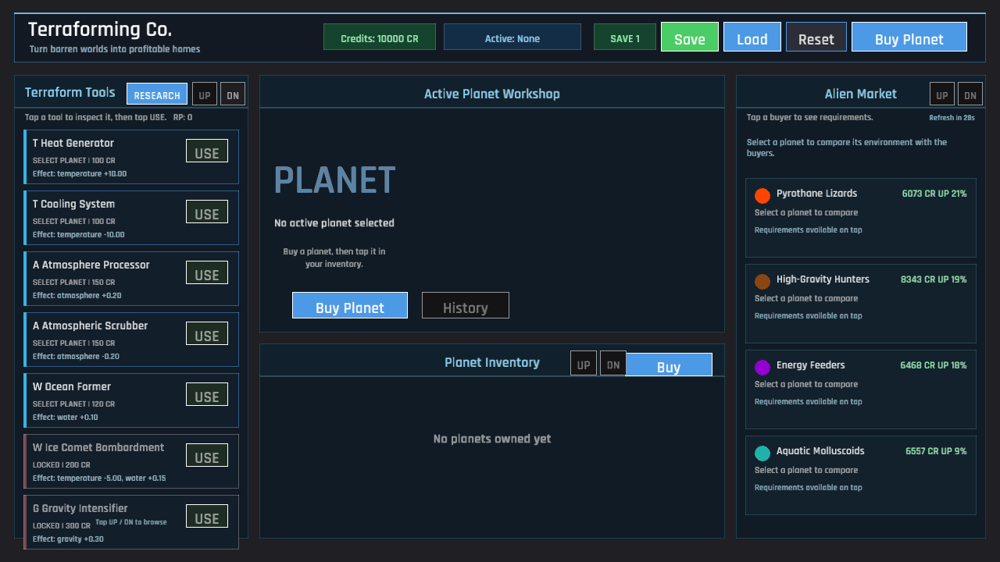
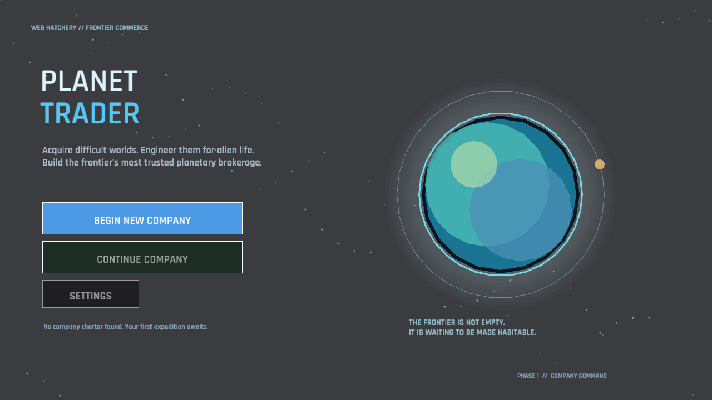
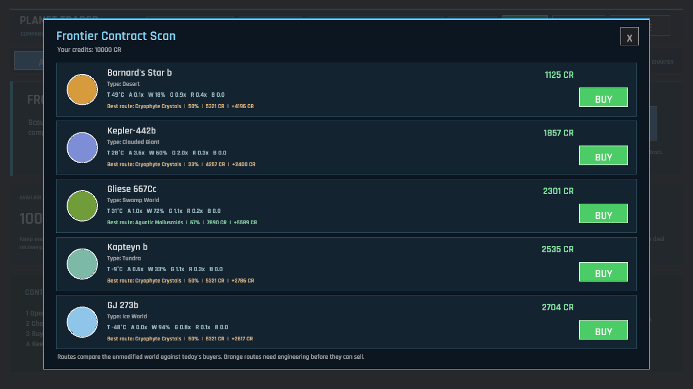

# Planet Trader Phase 0 / Phase 1 Visual Proof

## First launch

| Phase 0: immediate all-in-one dashboard | Phase 1: company front door |
| --- | --- |
|  |  |

Phase 0 opened directly into a dense tool/workshop/market grid. Phase 1 first
establishes the game fantasy, distinguishes New Company from Continue, exposes
Settings, and summarizes a returning charter before entering company command.

## Decision flow

| Phase 0: every system at once | Phase 1: focused acquisition and workshop |
| --- | --- |
|  |  |

The Phase 1 command deck separates Acquire, Workshop, Alien Market, Research,
and Company. Contract scans preview the best current buyer route before a
purchase; Workshop then exposes all six environmental systems, current best
deal, investment, and salvage value. Market previews profit and RP, Research
explains attainable progression, and Company turns trade history into rank and
contract reach.

## Player-visible Phase 1 evidence

- `ui_home.png`: identity, New Company, Continue, and Settings.
- `ui_tutorial.png`, `ui_tutorial_buy.png`, `ui_tutorial_market.png`:
  persistent action-driven onboarding and exact visible targets.
- `ui_acquisition.png`, `ui_contracts.png`: acquisition strategy and the
  reputation-expanded five-offer layout.
- `ui_biosphere.png`, `ui_market.png`: six-axis engineering, live demand,
  projected margins, RP, and disclosed recovery.
- `ui_research.png`, `ui_company.png`: attainable technology and company
  progression.
- `ui_settings.png`, `ui_reset.png`: real display, guidance, and save controls.

## Interactive verification

The published WebGL build was played from New Company through contract scan,
purchase, market inspection, workshop engineering, sale, research, tutorial
completion, and return to Home at 1280x720. The returning-company path and the
Research and Company modes were then checked at 1024x768. That walkthrough
found and fixed a tutorial-completion gap when the player used the Phase 1
Research tab, rather than the legacy action, to finish orientation.
